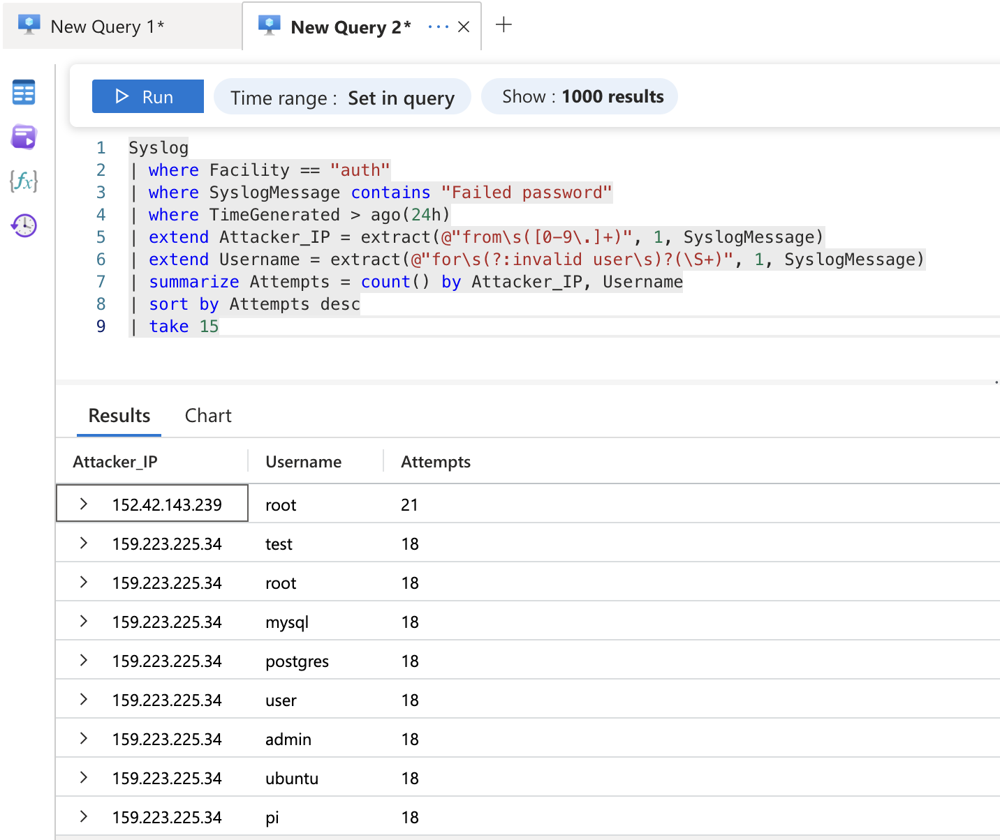

# Azure Sentinel SIEM Lab: Detecting & Responding to Live Brute Force Attacks


## Summary

Deployed a Microsoft Sentinel SIEM environment in Azure to detect, investigate, and respond to real-world SSH brute force attacks. Within 24 hours, detected **223 failed login attempts** from multiple attackers. Completed the full SOC Tier 1 workflow: triaged alerts, investigated incidents using KQL, documented findings, blocked attacker IPs, and closed incidents with proper classification.

---

## What I Did

| Task | What I Demonstrated |
|------|---------------------|
| Deployed Microsoft Sentinel | Set up a cloud SIEM from scratch in Azure |
| Configured data ingestion | Connected Syslog and Azure Activity logs using Data Collection Rules |
| Built detection rule | Wrote KQL query to detect 5+ failed SSH logins from same IP |
| Configured entity mapping | Extracted attacker IPs and usernames so they appear in incidents |
| Detected real attacks | Caught 223 brute force attempts from live attackers |
| Investigated incidents | Analyzed alerts, identified 2 attacker IPs targeting 7 usernames |
| Performed threat hunting | Wrote KQL queries to find attack patterns |
| Took remediation action | Blocked attacker IPs in Network Security Group |
| Closed incidents | Documented findings and classified as True Positive |

---

## Tools Used

- **Microsoft Sentinel** – SIEM for log analysis and incident management
- **Microsoft Defender XDR** – Unified security portal
- **Log Analytics Workspace** – Stores ingested logs
- **KQL (Kusto Query Language)** – Queries for detection and hunting
- **Azure Virtual Machine** – Ubuntu honeypot to attract attackers
- **Network Security Groups** – Firewall rules to block attackers

---

## Lab Setup

```
    ┌─────────────────┐
    │    INTERNET     │
    │    Attackers    │
    │  (Brute Force)  │
    └────────┬────────┘
             │
             ▼
┌──────────────────────────────────────────────────────────────────┐
│                         AZURE CLOUD                              │
│                                                                  │
│   ┌─────────────────┐         ┌─────────────────────────────┐    │
│   │  Ubuntu VM      │         │   Log Analytics Workspace   │    │
│   │  (Honeypot)     │────────▶│                             │    │
│   │                 │ Syslog  │   ┌─────────────────────┐   │    │
│   │ • SSH Exposed   │  via    │   │ Microsoft Sentinel  │   │    │
│   │ • Firewall Off  │  AMA    │   │ • Analytics Rules   │   │    │
│   │ • Port 22 Open  │         │   │ • Incidents         │   │    │
│   └─────────────────┘         │   │ • Workbooks         │   │    │
│                               │   │ • Entity Mapping    │   │    │
│                               │   └─────────────────────┘   │    │
│                               └─────────────────────────────┘    │
└──────────────────────────────────────────────────────────────────┘
```

I deployed an Ubuntu VM with SSH exposed to the internet and all firewall rules disabled. This created a honeypot that attracted real attackers. The VM sent authentication logs to Sentinel, where my detection rule generated alerts when brute force attempts occurred.

---

## Detection Rule

Created a scheduled analytics rule that triggers when an IP has 5+ failed SSH login attempts:

```kql
Syslog
| where Facility == "auth"
| where SyslogMessage contains "Failed password"
| extend Attacker_IP = extract(@"from\s([0-9\.]+)", 1, SyslogMessage)
| extend TargetUsername = extract(@"for\s(?:invalid user\s)?(\S+)", 1, SyslogMessage)
| summarize FailedAttempts = count() by Attacker_IP, TargetUsername, HostName
| where FailedAttempts >= 5
```

I configured **entity mapping** so the attacker IP and targeted username appear directly in the incident. This makes investigation faster—I don't have to dig through raw logs to find the key information.

<!-- Add your screenshot -->


---

## Attack Results

Within 24 hours, the honeypot detected:

| Metric | Value |
|--------|-------|
| Total failed login attempts | 223 |
| Attacker IPs identified | Multiple |
| Usernames targeted | 9 |
| Top targeted account | root (21 attempts) |

**Targeted usernames:** `root`, `postgres`, `mysql`, `ubuntu`, `test`, `user`, and others

The attackers targeted common service accounts (postgres, mysql) and default accounts (root, ubuntu). This indicates automated credential stuffing—bots scanning the internet for weak SSH passwords.

<!-- Add your screenshot -->


---

## Incident Investigation

When the alerts triggered, I performed the standard SOC Tier 1 workflow:

### 1. Triage
Reviewed the incident in Sentinel. The investigation graph showed:
- **2 attacker IPs**: `159.223.225.34` and `152.42.13.239`
- **7 targeted usernames**: Service and default accounts
- **16 alerts** grouped into one incident over 2 hours

<!-- Add your screenshot -->


### 2. Investigation
Ran KQL queries to understand the attack scope:

```kql
Syslog
| where Facility == "auth"
| where SyslogMessage contains "Failed password"
| where TimeGenerated > ago(24h)
| extend Attacker_IP = extract(@"from\s([0-9\.]+)", 1, SyslogMessage)
| extend Username = extract(@"for\s(?:invalid user\s)?(\S+)", 1, SyslogMessage)
| summarize Attempts = count() by Attacker_IP, Username
| sort by Attempts desc
```

### 3. Documentation
Added investigation notes to the incident:

> "Investigated brute force attempt from 159.223.225.34 and 152.42.13.239 targeting 7 service accounts. 16 alerts over 2 hours indicates automated attack. Confirmed malicious. Taking remediation action - blocking IPs in NSG."

### 4. Remediation
Blocked both attacker IPs in the Network Security Group:

<!-- Add your screenshot -->


### 5. Closure
Closed the incident with classification:
- **Status**: Resolved
- **Classification**: True Positive – Suspicious activity
- **Closing note**: "Remediation complete. Blocked attacker IPs in NSG. Incident closed."

<!-- Add your screenshot -->


---

## What I Learned

**Entity mapping matters.** My first version of the detection rule didn't have entity mapping configured. Incidents showed alerts but no attacker details. After adding entity mapping, the IP and username appeared right in the incident—exactly how it should work in a production SOC.

**Attackers are fast.** Within hours of exposing the VM, automated scanners found it. This reinforced why defense in depth is critical—firewalls, strong passwords, and monitoring all work together.

**KQL enables quick investigation.** Instead of scrolling through raw logs, I wrote queries to summarize attacker activity in seconds. This is how analysts scale their work.

**Documentation closes the loop.** Adding investigation notes and proper classification creates an audit trail. If another analyst sees this incident, they know exactly what happened and what action was taken.

---

## MITRE ATT&CK

| Tactic | Technique | ID |
|--------|-----------|-----|
| Credential Access | Brute Force | T1110 |

---

## Screenshots

| Description | File |
|-------------|------|
| Sentinel overview with data | `sentinel-overview.png` |
| Data connectors connected | `data-connectors.png` |
| Analytics rule with entity mapping | `analytics-rule.png` |
| Incidents triggered | `incidents.png` |
| Investigation graph showing IPs and users | `investigation-graph.png` |
| KQL threat hunting results | `kql-hunting.png` |
| NSG block rule | `nsg-block-rule.png` |
| Incident closed with classification | `incident-closed.png` |

---

## Connect With Me

- LinkedIn: [Your LinkedIn URL]
- GitHub: [Your GitHub URL]
