# Azure Sentinel SIEM Lab: Detecting & Responding to Live Brute Force Attacks


## Summary

Built a Microsoft Sentinel SIEM environment in Azure to detect, investigate, and respond to real-world SSH brute force attacks. Within 24 hours, detected **223 failed login attempts** from multiple attackers targeting service accounts. Investigated incidents, blocked attacker IPs, and closed cases with proper documentation.

---

## Tools Used

- **Microsoft Sentinel** – SIEM for log analysis and incident management
- **Microsoft Defender XDR** – Unified security portal
- **Log Analytics Workspace** – Log storage and query engine
- **KQL (Kusto Query Language)** – Detection and threat hunting queries
- **Azure Virtual Machine** – Ubuntu honeypot
- **Network Security Groups** – Firewall rules for remediation

---

## Lab Architecture

```
                    ┌─────────────────┐
                    │    INTERNET     │
                    │    Attackers    │
                    │  (Brute Force)  │
                    └────────┬────────┘
                             │
                             ▼
┌──────────────────────────────────────────────────────────────────┐
│                         AZURE CLOUD                              │
│                                                                  │
│   ┌─────────────────┐         ┌─────────────────────────────┐    │
│   │  Ubuntu VM      │         │   Log Analytics Workspace   │    │
│   │  (Honeypot)     │────────▶│                             │    │
│   │                 │ Syslog  │   ┌─────────────────────┐   │    │
│   │ • SSH Exposed   │  via    │   │ Microsoft Sentinel  │   │    │
│   │ • Firewall Off  │  AMA    │   │ • Analytics Rules   │   │    │
│   │ • Port 22 Open  │         │   │ • Incidents         │   │    │
│   └─────────────────┘         │   │ • Workbooks         │   │    │
│                               │   │ • Entity Mapping    │   │    │
│                               │   └─────────────────────┘   │    │
│                               └─────────────────────────────┘    │
└──────────────────────────────────────────────────────────────────┘
```

---

## Setting Up the Environment

### Created the Azure Infrastructure

Started by creating a Resource Group to organize all lab resources in one place. This makes it easy to manage and delete everything when the lab is complete.

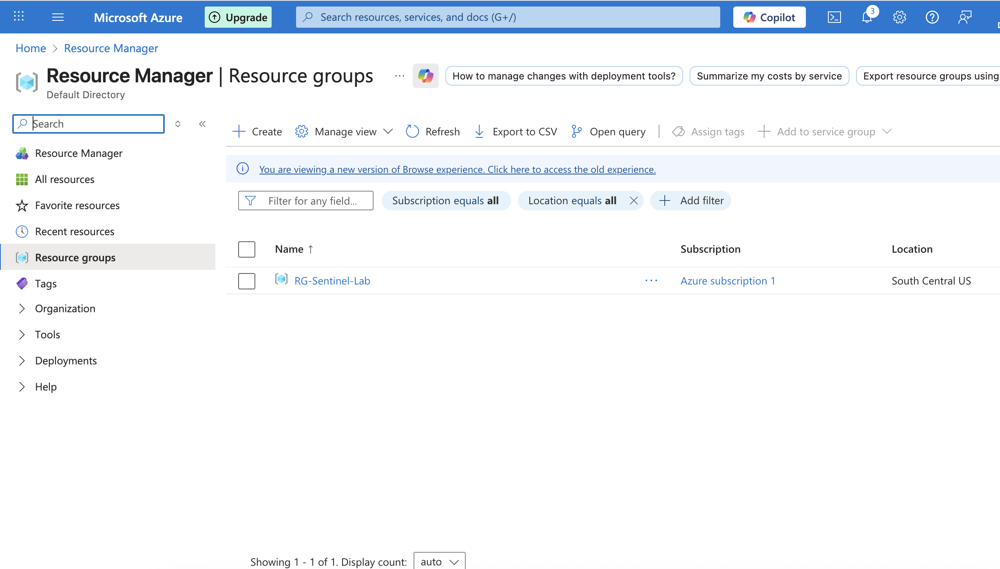

Next, created a Log Analytics Workspace. This is where all the security logs get stored and where Sentinel runs its queries.

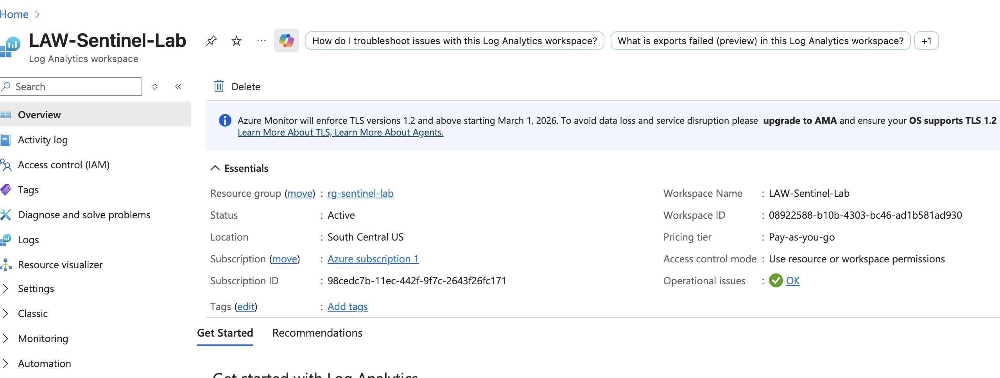

### Deployed Microsoft Sentinel

Added Microsoft Sentinel to the Log Analytics Workspace. Sentinel is the SIEM that analyzes logs, generates alerts, and manages incidents.

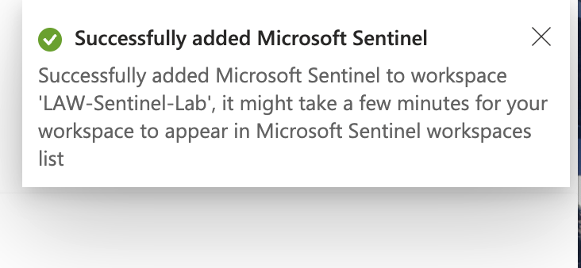

---

## Configuring Data Ingestion

### Installed the Syslog Solution

From the Content Hub, installed the Syslog solution to enable Linux log collection. This provides the data connector needed to pull authentication logs from the honeypot VM.

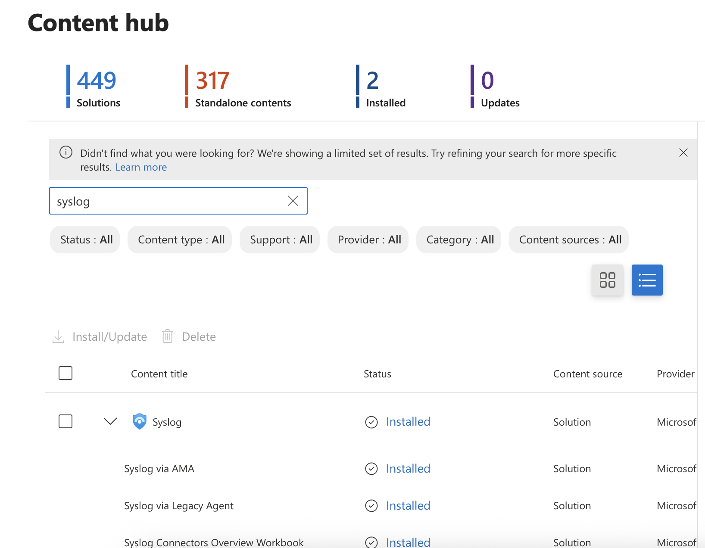

### Created a Data Collection Rule

Configured a Data Collection Rule (DCR) to specify which logs to collect and where to send them. Set it to collect LOG_AUTH events, which capture all authentication activity including failed SSH logins.

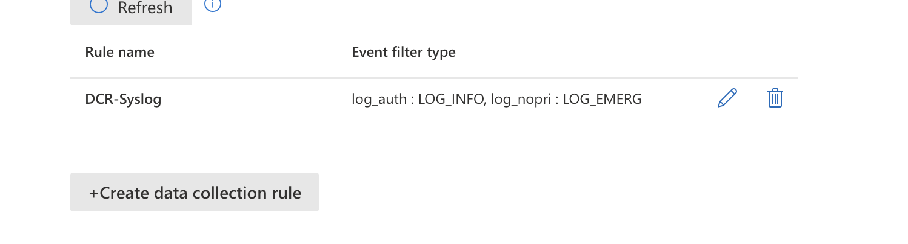

### Connected Azure Activity Logs

Also connected Azure Activity to monitor any changes made in the Azure environment itself.

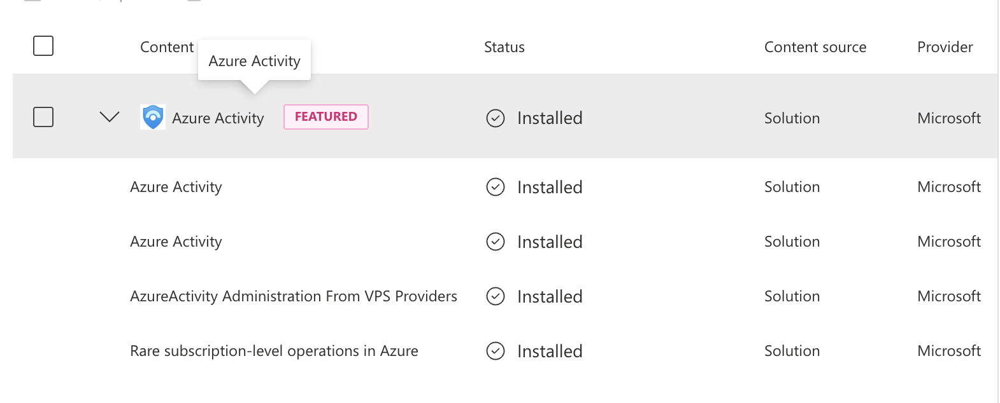

---

## Deploying the Honeypot

### Created an Ubuntu VM

Deployed an Ubuntu Server VM with SSH exposed to the internet. This serves as the honeypot to attract real attackers.

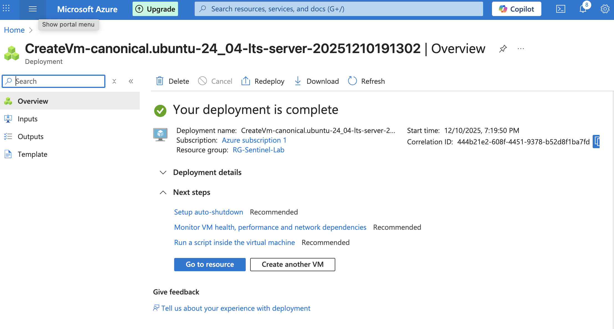

### Opened the Firewall

Configured the Network Security Group to allow ALL inbound traffic. This makes the VM discoverable by attackers scanning the internet.

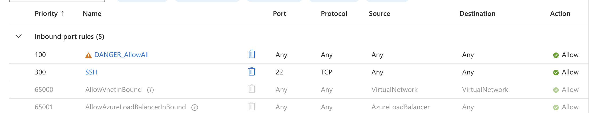

### Disabled Host Firewall

Connected to the VM via SSH and disabled the host firewall to ensure nothing blocks incoming connection attempts.

```bash
sudo ufw disable
```
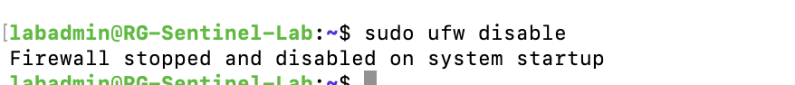

Within hours, attackers found the exposed VM and started brute force attempts.

---

## Building the Detection Rule

### Created a Scheduled Analytics Rule & Configured Entity Mapping

Built a custom analytics rule to detect brute force attacks. The rule triggers when an IP address has 5 or more failed SSH login attempts.

Added entity mapping so the attacker IP and targeted username appear directly in incidents. This saves time during investigation—no need to dig through raw logs to find the key details.

- **IP Entity** → `Attacker_IP`
- **Account Entity** → `TargetUsername`

**KQL Detection Query:**
```kql
Syslog
| where Facility == "auth"
| where SyslogMessage contains "Failed password"
| extend Attacker_IP = extract(@"from\s([0-9\.]+)", 1, SyslogMessage)
| extend TargetUsername = extract(@"for\s(?:invalid user\s)?(\S+)", 1, SyslogMessage)
| summarize FailedAttempts = count() by Attacker_IP, TargetUsername, HostName
| where FailedAttempts >= 5
```
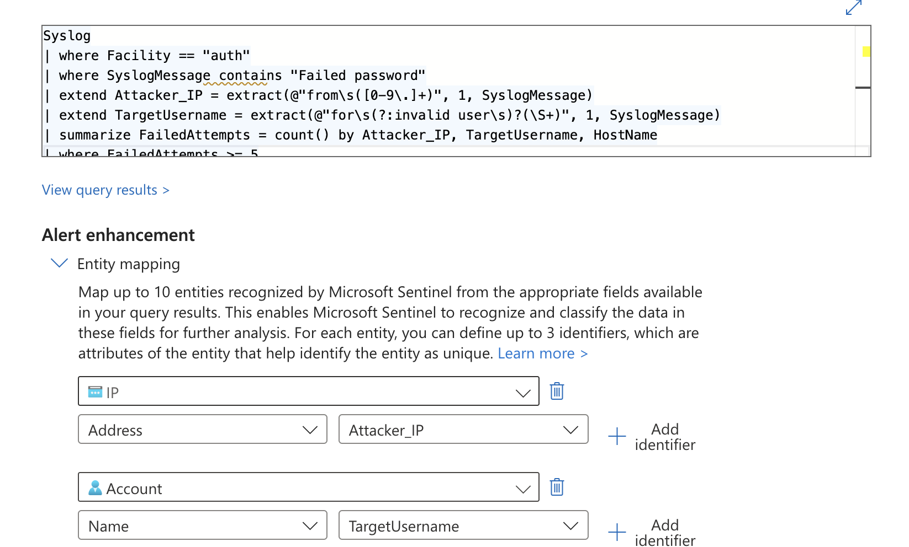

---

## Attack Results

Within 24 hours, the honeypot detected:

| Metric | Value |
|--------|-------|
| Total failed login attempts | 223 |
| Top targeted account | root (21 attempts) |

**Targeted usernames:** `root`, `postgres`, `mysql`, `ubuntu`, `test`, `user`

The attackers went after common service accounts (postgres, mysql) and default accounts (root, ubuntu). This pattern indicates automated credential stuffing—bots scanning the internet for weak SSH passwords.


---

## Investigating the Incident

When alerts triggered, Sentinel grouped them into an incident. The investigation graph showed:

- **2 attacker IPs**: `159.223.225.34` and `152.42.13.239`
- **7 targeted usernames**
- **16 alerts** over 2 hours

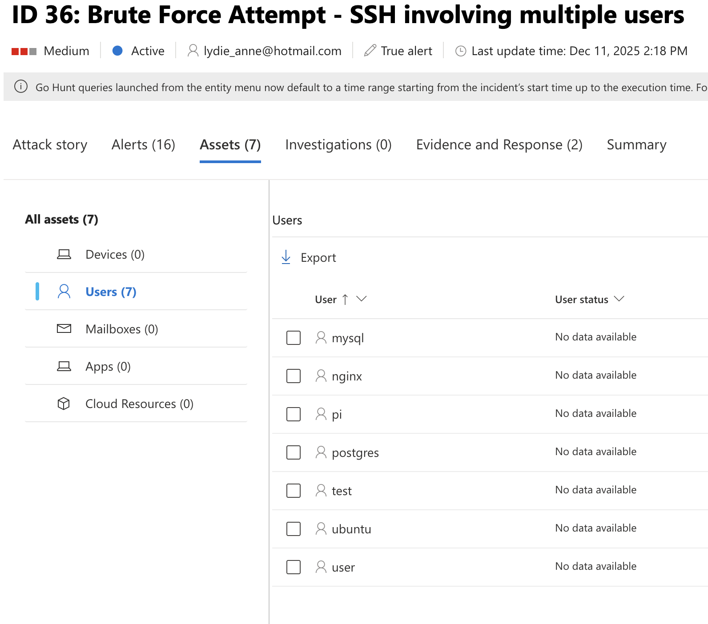

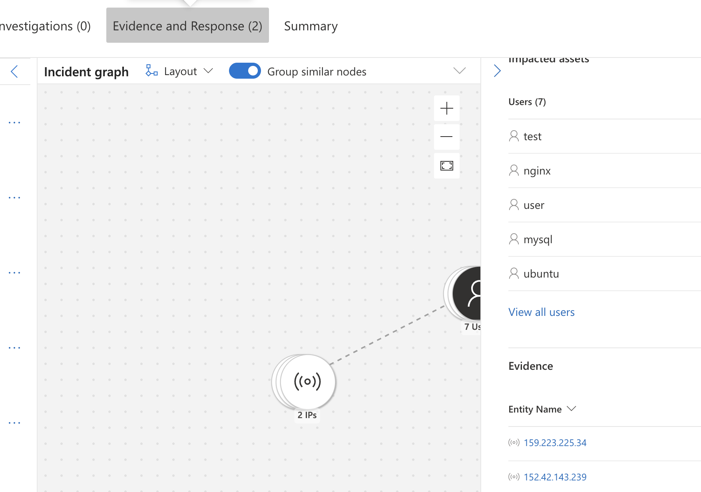

## Responding to the Threat

### Documented Findings

Added investigation notes to the incident:

> "Investigated brute force attempt from 159.223.225.34 and 152.42.13.239 targeting 7 service accounts. 16 alerts over 2 hours indicates automated attack. Confirmed malicious. Taking remediation action - blocking IPs in NSG."

### Blocked Attacker IPs

Created a Deny rule in the Network Security Group to block both attacker IPs from reaching the honeypot.

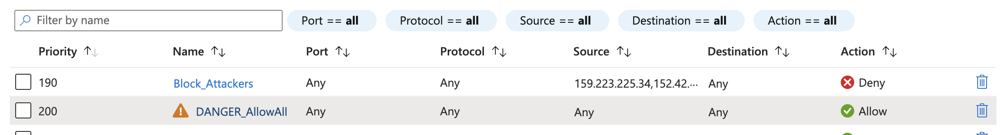

### Closed the Incident

Resolved the incident with proper classification:

- **Status**: Resolved
- **Classification**: True Positive – Suspicious activity
- **Closing note**: "Took remediation action - bloacked IPs in NSG."

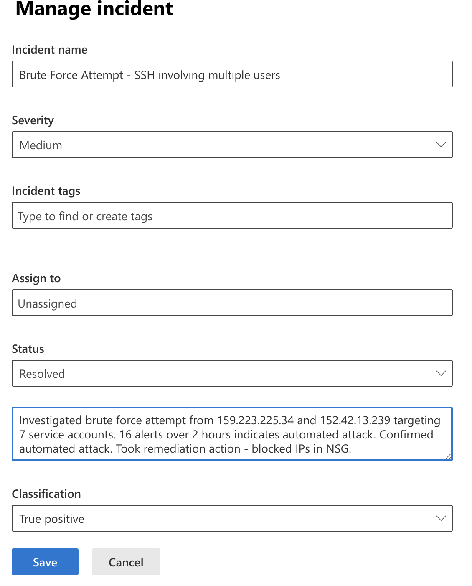

---

## What I Learned

**Entity mapping makes a difference.** My first version of the detection rule worked but didn't show attacker details in the incident view. After adding entity mapping, the IP and username appeared right in the incident—the way it should work in a production SOC.

**Attackers move fast.** Within hours of exposing the VM, automated scanners found it. This reinforced why defense in depth matters—firewalls, strong passwords, and monitoring all work together.

**KQL speeds up investigation.** Instead of scrolling through raw logs, I wrote queries to summarize attacker activity in seconds.

**Documentation closes the loop.** Adding investigation notes and proper classification creates an audit trail. If another analyst looks at this incident, they know exactly what happened and what action was taken.

---

## MITRE ATT&CK

| Tactic | Technique | ID |
|--------|-----------|-----|
| Credential Access | Brute Force | T1110 |

